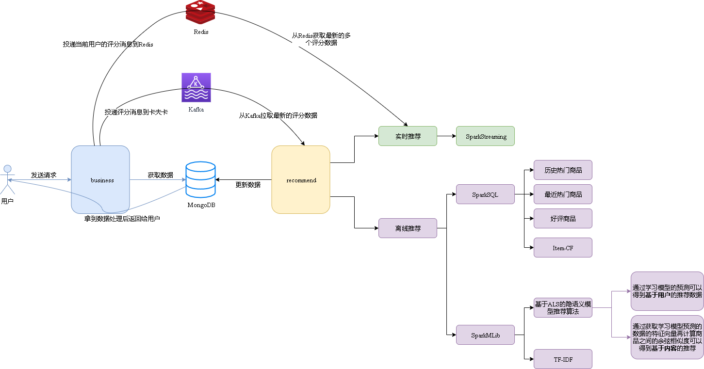
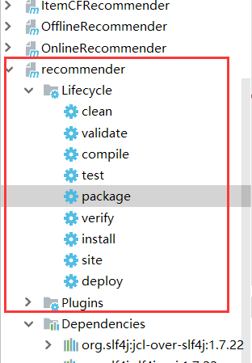

# 后端简介

## 一、recommend

独立运行的推荐源代码，分为实时推荐以及离线推荐，综合利用了协同过滤算法以及基于内容的推荐方法来提供混合推荐  

### 技术栈简介

1. Spark
2. Spark SQL
3. SparkMLlib
4. ~~Flink（尚未启用，2.0 版本开发即将启动）~~
5. ~~FlinkML（2.0 版本即将迁移到 Flink 上）~~
6. MongoDB：存储文本数据
7. Redis：保存用户的评分数据，为实时处理提供高速的数据传输，数据格式为每一个 userId 里面保存多个 productId:rates，即
   1. userId:123456
      1. 10010:4.5
      2. 10011:2.3
   2. userId:654321
      1. XXXX
8. 项目各个模块的原理详解，请点击[这里]( https://github.com/ittqqzz/ECommerceRecommendSystem/blob/master/backend/detail.md )

### 项目总览

离线计算均为批处理任务，使用 SparkSQL 与 SparkMLib 辅助处理

实时计算需要 SparkStreaming 辅助处理



### 离线推荐部分

1. 统计服务（Spark Core + Spark SQL）
2. 推荐服务（Spark Core + Spark MLlib + ALS 算法）

### 实时推荐部分：

1. 获取消息服务（Redis + Kafka）
2. 推荐服务（Spark Streaming）

### 数据集格式

商品数据集

| **字段名**     | **字段类型** | **字段描述**  | **字段备注**     |
| -------------- | ------------ | ------------- | ---------------- |
| **productId**  | Int          | 商品的ID      |                  |
| **name**       | String       | 商品的名称    |                  |
| **categories** | String       | 商品所属类别  | 每一项用“\|”分割 |
| **imageUrl**   | String       | 商品图片的URL |                  |
| **tags**       | String       | 商品的UGC标签 | 每一项用“\|”分割 |

用户评分数据集

| **字段名**    | **字段类型** | **字段描述** |
| ------------- | ------------ | ------------ |
| **userId**    | Int          | 用户的ID     |
| **productId** | Int          | 商品的ID     |
| **score**     | Double       | 商品的分值   |
| **timestamp** | Long         | 评分的时间   |

### 算法简介

ALS：通过观察到的所有用户给产品的打分，来推断每个用户的喜好并向用户推荐适合的产品

TF-IDF：提取最能代表文本的关键词

### 启动

运行前需要安装组件

1. Zookeeper
2. Kafka
3. Redis
4. MongoDB

源码里面涉及的 IP 是我的真实阿里云地址，服务已经搭建完毕，可以直接运行 business 模块体验。也可以自行安装这些组件，不过需要自己翻阅源码将 IP 地址替换掉

#### 启动 business

在 IDEA 里面直接将 business 模块部署到 Tomcat 或者使用 maven 的 tomcat 插件运行即可，最后访问 http://localhost:8088/business

#### 启动 recommender

确保已经安装 scala，版本号 2.11 +

1. 首次运行需要加载冷数据到 MongoDB 里面

进入到 DataLoader 里面执行  DataLoader.scala

2. 然后依次执行离线计算 main 程序（使用 Azkaban 来调度离线任务）

StatisticsRecommender、OfflineRecommender、ItemCFRecommender、ContentRecommender

3. 最后执行实时计算 main 程序

OnlineRecommender

### 部署

分别执行 recommender 与 businessServer 的 package 命令，会对这两个项目分别打包

<div align="center"> 
 
 
</div>

```
[INFO] ------------------------------------------------------------------------
[INFO] Reactor Summary:
[INFO] 
[INFO] recommender ........................................ SUCCESS [  4.006 s]
[INFO] DataLoader ......................................... SUCCESS [ 28.439 s]
[INFO] StatisticsRecommender .............................. SUCCESS [ 12.756 s]
[INFO] OfflineRecommender ................................. SUCCESS [ 10.193 s]
[INFO] OnlineRecommender .................................. SUCCESS [  9.045 s]
[INFO] ContentRecommender ................................. SUCCESS [  7.880 s]
[INFO] ItemCFRecommender .................................. SUCCESS [  6.769 s]
[INFO] ------------------------------------------------------------------------
[INFO] BUILD SUCCESS
[INFO] ------------------------------------------------------------------------
[INFO] Total time: 01:19 min
[INFO] Finished at: 2019-10-30T14:04:57+08:00
[INFO] Final Memory: 24M/171M
[INFO] ------------------------------------------------------------------------
```

BusinessServe.war 部署到 tomcat 等 web 容器里面

## 二、business

简易的 Spring Web 后台，用 maven 打包后直接跑起来即可，注意打包的时候要将依赖也打进去。

用户的评分数据除了通过 Kafka 发送到实时推荐系统，还要记录到 Redis 里面，这样就可以获取同一个用户最近几次的全部评分数据了，使实时计算更加精准。

## 三、Env  Configuration Introduce

本项目是一个学习型的，所以环境很简单，搭建起来也很容易。

首先安装必要的中间件：Redis、Kafka、MongoDB，安装全部走单机版默认配置，百度一下就能安装好

然后是安装Scala，我的Scala版本如下：

```
~ scala
Welcome to Scala 2.11.12 (Java HotSpot(TM) 64-Bit Server VM, Java 1.8.0_121).
Type in expressions for evaluation. Or try :help.

```

Java 版本是 JDK 1.8

和 IDEA 搭配的 Scala 插件版本：scala-intellij-bin-2019.2.15.zip

然后就是你的 Maven 配置，首先我的版本号是 3.5，其次使用国内的镜像源，这个项目严重依赖 Maven，请务必配置好Maven，项目是使用 Maven 父子工程搭建的，请仔细检查 pom.xml 文件里面的依赖是否都正确加载

然后是Tomcat，我的版本是 8.5.23，IDEA 里面主要配置如下图：

[](https://imgtu.com/i/ccObyq)

最后一点，配置好组件之后还可能要修改一下代码里面的连接参数，因为连接配置信息是硬编码的，需要检查一下

环境配置其实很简单的，各个组件、插件，按照单机版的默认配置安装好，最后让各个组件能连接上系统即可