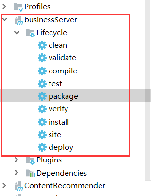

# 后端简介

## 一、recommend

独立运行的推荐源代码，分为实时推荐以及离线推荐

### 技术栈简介

1. Spark
2. SparkMLlib
3. Flink（尚未启用）
4. FlinkML
5. MongoDB：存储文本数据
6. Redis：保存用户的评分数据，格式为每一个 userId 里面保存多个 productId:rates，即
   1. userId:123456
      1. 10010:4.5
      2. 10011:2.3
   2. userId:654321
      1. XXXX
7. 

### 项目总览

离线计算均为批处理任务，使用 SparkSQL 与 SparkMLib 辅助处理

实时计算需要 SparkStreaming 辅助处理


### 算法简介（暂缓）

ALS：

TF-IDF：

Item-CF：

### 启动

运行前需要安装组件：

1. Zookeeper
2. Kafka
3. Redis
4. MongoDB

源码里面涉及的 IP 是我的真实阿里云地址，服务已经搭建完毕，可以直接运行 business 模块体验。也可以自行安装这些组件，不过需要自己翻阅源码将 IP 地址替换掉

#### 启动 business

在 IDEA 里面直接将 business 模块部署到 Tomcat 或者使用 maven 的 tomcat 插件运行即可，最后访问 http://localhost:8088/business

#### 启动 recommender

确保已经安装 scala，版本号 2.11 +

1. 首次运行需要加载冷数据到 MongoDB 里面

进入到 DataLoader 里面执行  DataLoader.scala

2. 然后依次执行离线计算 main 程序（使用 Azkaban 来调度离线任务）

StatisticsRecommender、OfflineRecommender、ItemCFRecommender、ContentRecommender

3. 最后执行实时计算 main 程序

OnlineRecommender

### 部署

分别执行 recommender 与 businessServer 的 package 命令，会对这两个项目分别打包

<div align="center"> 
 
 
</div>

```
[INFO] ------------------------------------------------------------------------
[INFO] Reactor Summary:
[INFO] 
[INFO] recommender ........................................ SUCCESS [  4.006 s]
[INFO] DataLoader ......................................... SUCCESS [ 28.439 s]
[INFO] StatisticsRecommender .............................. SUCCESS [ 12.756 s]
[INFO] OfflineRecommender ................................. SUCCESS [ 10.193 s]
[INFO] OnlineRecommender .................................. SUCCESS [  9.045 s]
[INFO] ContentRecommender ................................. SUCCESS [  7.880 s]
[INFO] ItemCFRecommender .................................. SUCCESS [  6.769 s]
[INFO] ------------------------------------------------------------------------
[INFO] BUILD SUCCESS
[INFO] ------------------------------------------------------------------------
[INFO] Total time: 01:19 min
[INFO] Finished at: 2019-10-30T14:04:57+08:00
[INFO] Final Memory: 24M/171M
[INFO] ------------------------------------------------------------------------
```

BusinessServe.war 部署到 tomcat 等 web 容器里面

## 二、business

简易的 Spring Web 后台，用 maven 打包后直接跑起来即可，注意打包的时候要将依赖也打进去。

用户的评分数据除了通过 Kafka 发送到实时推荐系统，还要记录到 Redis 里面，这样就可以获取同一个用户最近几次的全部评分数据了，使实时计算更加精准。