# 前提

目前所有的模块均在 Spark 环境中运行，所以全部模块代码的开始需要加载 Spark 环境

```java
// setMaster(“local[2]”)括号里的参数”local[2]’字符串表示运行在本地模式下，并且启动2个工作线程。
val spark = SparkSession.builder().config(new SparkConf().setAppName("模块名称")
                                          .setMaster("local[2]")).getOrCreate()

    
// Seconds(5)表示每隔5秒钟就自动执行一次流计算
val ssc = new StreamingContext(spark.sparkContext, Seconds(5))
```

# DataLoader

1. 使用 sparkContext 加载 CSV 文件成 RDD
2. 然后 map RDD 分离字段构造 case class，得到 DataFrame
3. 接着使用 Spark SQL 将两个 DF 写入到 MongoDB

这样就在 DB 里面载入了以供学习、统计、展示的基础冷数据。如图：

商品数据表：

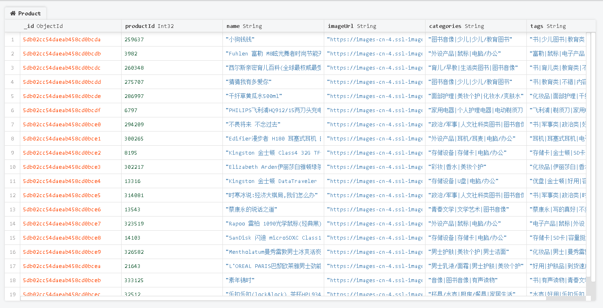

用户评分数据表：

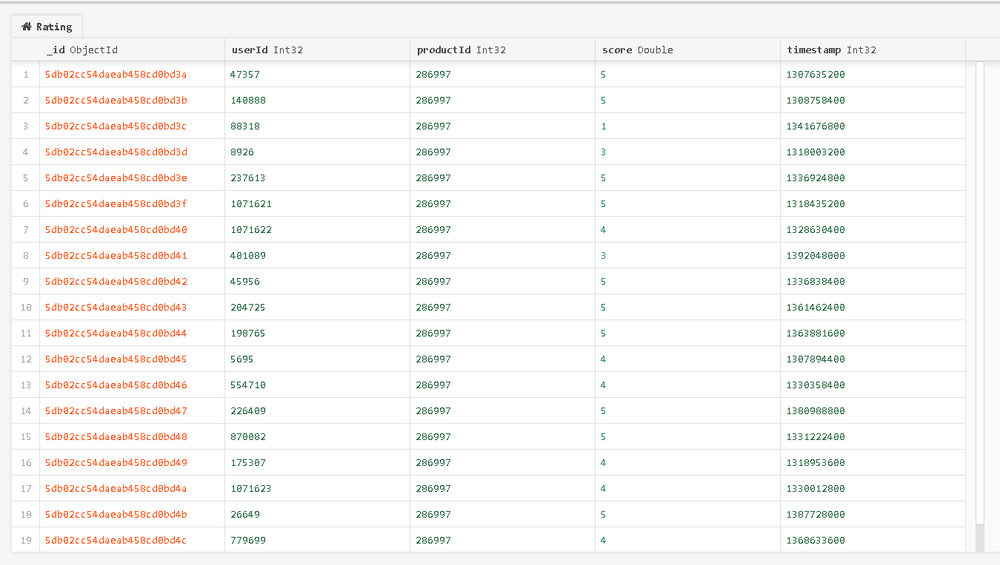

# 离线服务

## 离线统计（StatisticsRecommender）
StatisticsRecommender 服务主要**读取用户评分数据表**，使用 SQL 语句直接取出以下三种数据：

1. **热门商品**：统计评分次数最多的商品（越多人评价它，表名它越火）

```sql
select productId, count(productId) as count from ratings group by productId order by count desc
```

2. **最近热门商品**：还是按照出现次数最多的统计，但是这一次先按事件降序，再按商品评价次数降序

   1. 先把 Unix 时间戳改成年月格式

   ```sql
   select productId, score, changeDate(timestamp) as yearmonth from ratings
   ```

   2. 在新的数据集上执行 SQL

```sql
select productId, count(productId) as count, yearmonth from ratingOfMonth group by yearmonth, productId order by yearmonth desc, count desc
```

3. **好评商品**：很显然要计算各个商品的平均分，降序得到结果

```SQL
select productId, avg(score) as avg from ratings group by productId order by avg desc
```

最终得到三个数据集，并写入到 MongoDB 里面，如图：

热门商品：

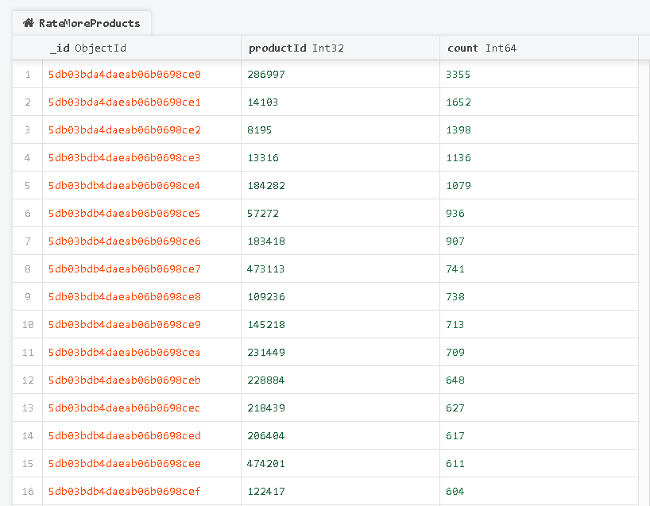

最近热门商品：

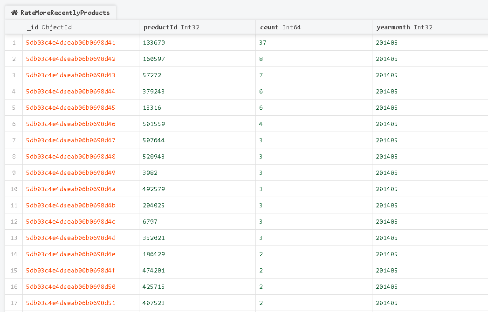

好评商品：

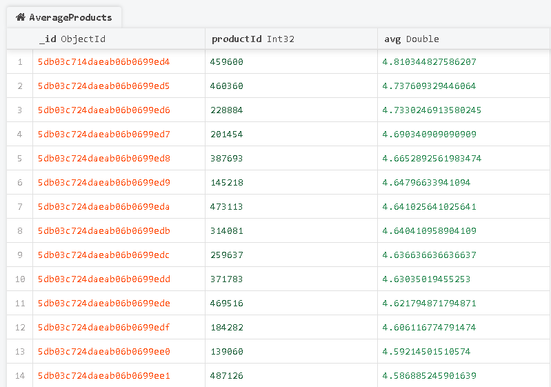

## 离线推荐（OfflineRecommender）

OfflineRecommender 服务主要是**采用 ALS 作为协同过滤算法**，根据 MongoDB 中的**用户评分表**计算离线的用户商品推荐列表以及商品相似度矩阵

### 相关概念普及

####  文本挖掘 

文本挖掘是抽取有效、新颖、有用、可理解的、散布在文本文件中的有价值知识，并且利用这些知识更好地组织信息的过程。

[点击查看更多解释]( https://blog.csdn.net/xianjie0318/article/details/79279590 )

####  隐语义模型 

属于一种语义分析技术，找出文本潜在的分类或主题。

例如 A 喜欢看《操作系统》，B 喜欢看《巴黎圣母院》。通过隐语义分析可得 A 喜欢“计算机”类的书籍，B 喜欢“文学”类书籍。这就是隐语义。

```
而通过偏好相似，或内容相似的推荐不属于隐语义模型
```

[点击查看更多解释]( https://www.jianshu.com/p/7b6bb28c1753 )

#### 协同过滤

利用集体智慧，把大家都喜欢的东西互相推荐。所以就要求提前收集用户偏好，有大量的数据可供分析。
##### 分类
###### 基于领域的
* 基于物品的
* 基于用户的
###### 基于模型的
* 基于隐语义模型的 ALS 算法
* 基于贝叶斯网络
* 基于 SVM 的
###### 基于混合的
* Item-User CF

[查看更多]( https://www.cnblogs.com/Little-Li/p/11354590.html )

#### ALS

ALS 算法属于一种协同过滤算法

```
ALS 是交替最小二乘 （alternating least squares）的简称。

在机器学习的上下文中，ALS 特指使用交替最小二乘求解的一个协同推荐算法。它通过观察到的所有用户给产品的打分，来推断每个用户的喜好并向用户推荐适合的产品。

从协同过滤的分类来说，AL S算法属于 User-Item CF，也叫做混合 CF。它同时考虑了 User 和 Item 两个方面。

用户和商品的关系，可以抽象为一个三元组：<User,Item,Rating> 
```

几个关键字：

1. 矩阵降维
2. 稀疏矩阵

#### 余弦相似度

余弦相似度用向量空间中两个向量夹角的余弦值作为衡量两个个体间差异的大小。
余弦值越接近1，就表明夹角越接近 0 度，也就是两个向量越相似，这就叫"余弦相似性"。

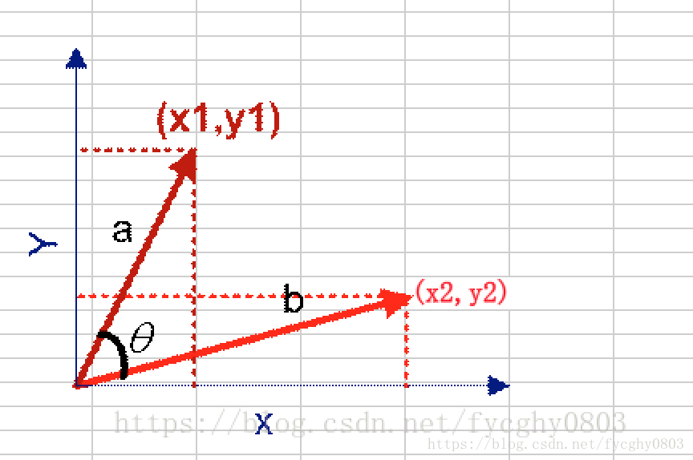

### 实现过程

ALS 这个东西的使用在 mllib 里面已经有实现了，他需要先训练一个模型出来，再通过模型预测数据

训练数据需要使用 ALS.train() 方法，传入训练数据以及控制参数

预测数据需要使用 model.predict() 方法，传入测试数据即可

1. 加载用户评分数据

2. 把 userId 和 productId 提取出来形成两个独立的 RDD，计算他们的笛卡尔积得到 userProducts，作为训练数据集

3. 把 userId 和 productId 以及 score 提取出来形成一个三元组构造训练数据集以及测试数据集

4. 训练数据得到 model，再通过 model 预测得到推荐数据，然后把推荐数据写入到 MongoDB（该推荐是基于用户的，如下图）

5. 通过 model 得到的不只有预测数据，还可以拿到 productFeatures，即各个商品以及它的**特征**

   1. 使用 <productId, features> 可以构造商品的特征向量：(productId, new DoubleMatrix(features))
   2. 把这个特征向量拿来和它自己做笛卡尔积可以得到 A 商品和其他所有非 A 商品的相似度关系
   3. [点击查看为什么要使用笛卡尔积]( http://blog.sina.com.cn/s/blog_7308ed2f0102x327.html )
   4. 然后计算余弦相似度

   ```scala
   // a 是做笛卡尔积的 this
   // b 是做笛卡尔积的 other
   case (a, b) =>
           val simScore = consinSim(a._2, b._2) // a._2 就是 new DoubleMatrix(features)
           (a._1, (b._1, simScore)) // 这样就得到了 a 商品和 b 商品的相似度评分
   ```

   5. 再根据 a._1 （productId）分组得到推荐列表，如下图。

6. 将推荐列表写入到 MongoDB（该推荐是基于物品的）

余弦相似度的计算结果入库：

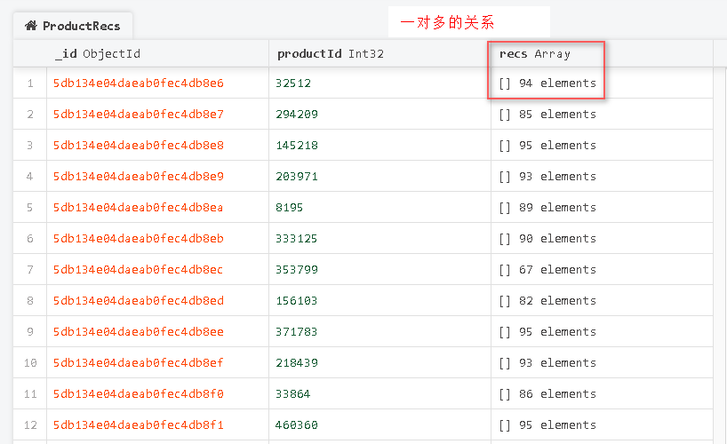

ALS model 预测数据入库：

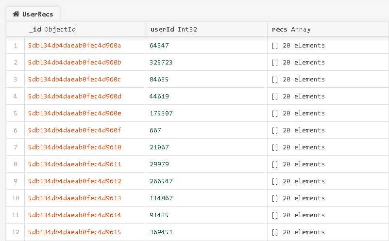

### 训练参数的选取

在 ALS.train 方法中涉及三个控制参数，他们的选取影响着预测的精度。

```scala
// 定义模型训练的参数，rank隐特征个数，iterations迭代词数，lambda正则化系数
val (rank, iterations, lambda) = (5, 10, 0.1)

// rank：表示隐特征的维度 K，要使用多少个特征
// iterations：迭代次数，交替相乘的次数
// lambda：正则化参数
val model = ALS.train(trainData, rank, iterations, lambda) //得到一个成熟的预测模型，下面使用该模型去预测

```

​         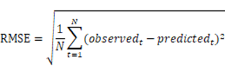  

通过计算均方根误差（RMSE）可以找到最佳的训练参数，就是不断地调整参数值，来选取 RMSE 最小的一组作为我们模型的优化选择  

具体过程：

1. 加载评分数据
2. 把数据按照三七分、二八分等规则切成两部分，一部分是训练数据，一部分是测试数据（要试很多次）
3. 然后给 rank 和 lambda 也给很多值，挨个测试，得到 model
4. 把 model 和测试数据丢带 RMSE 公式里面计算[标准误差](https://baike.baidu.com/item/标准误差) 
5. 在这么多次尝试中，输出误差值最小的结果

[点击查看误差计算过程参考资料]( https://www.aboutyun.com/thread-19999-1-1.html )

# 实时服务

## 特点

离线服务是综合历史数据来计算的，**但实时服务应该根据用户最近的行为来推荐**

实时推荐要求响应迅速，所以不能再使用 ALS 了

为了快速响应，应该提前预热数据，在已有的数据集上再次少量计算即可

实时推荐系统更关心推荐结果的动态变化能力，只要更新推荐结果的理由合理即可，至于推荐的**精度则可以适当放宽**  

## 算法设计

总体目标：用户对某一个商品进行了评分，所以选取与该商品最相似的 K 个商品作为备选商品

每个商品按照【推荐优先级】这一权重作为推荐给用户的先后顺序。根据用户最近的若干评分，计算出每个备选商品的【推荐优先级】，同时，根据上一次的推荐结果进行基于优先级的合并、替换，得到新的推荐结果。

具体而言：

首先，获取用户 u 按时间顺序最近的 K 个评分，记为 RK；获取商品 p 的最相似的 K 个商品集合，记为 S；
然后，对于每个备选商品 q ，计算其推荐优先级 ，计算公式如下：

​         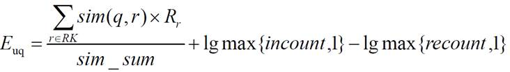  

其中：
Rr 表示用户 u 对商品 r 的评分；
sim(q,r) 表示商品 q 与商品 r 的相似度，设定最小相似度为 0.6，当商品 q 和商品 r 相似度低于 0.6 的阈值，则视为两者不相关并忽略；
sim_sum 表示 q 与 RK 中商品相似度大于最小阈值的个数；
incount 表示 RK 中与商品 q 相似的、且本身评分较高（>=3）的商品个数；
recount 表示 RK 中与商品 q 相似的、且本身评分较低（<3）的商品个数；

## 实现流程

1. 加载 MongoDB 里面的 ProductRecs 作为实时计算的基础数据
2. 用户 u 对商品 p 进行了评分，就触发一次实时计算
3. 从 ProductRecs  中选出与商品 p 最相似的 K 个商品作为集合 S
   1. 要过滤掉用户 u 自己评分过的其他全部商品，过滤掉之后推荐的东西才是他没有见过的
4. 从 Redis 中获取用户 u 最近时间内的 K 条评分，包含本次评分，作为集合 RK
5. 把从1、2、3 里面拿到的数据作为参数，开始计算商品的推荐优先级，产生 <qID,> 集合 updated_S
6. 将 updated_S 与上次对用户 u 的推荐结果 Rec 利用公式进行合并，产生新的推荐结果 NewRec 作为最终输出

最终输出结果：

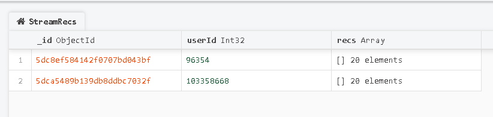

# 冷启动问题处理  

对于新注册的用户，没有任何评分数据可以使用，也就是不知道他的偏好，导致以上的所有推荐失效。

解决办法：

1. 强制用户选择个人喜好（弹个框）
2. 收集用户浏览行为，然后预测用户偏好（最常用的办法）
3. 提前给所有的商品计算相似关联商品

下面介绍项目里面使用的第三个解决办法，通过基于内容与物品的离线计算可以得到商品展示页面类似于【猜你喜欢】【看过这个商品的人也看了..】的数据

## 基于内容（UGC）的推荐

商品数据集格式为

| **字段名**     | **字段类型** | **字段描述**  | **字段备注**     |
| -------------- | ------------ | ------------- | ---------------- |
| **productId**  | Int          | 商品的ID      |                  |
| **name**       | String       | 商品的名称    |                  |
| **categories** | String       | 商品所属类别  | 每一项用“\|”分割 |
| **imageUrl**   | String       | 商品图片的URL |                  |
| **tags**       | String       | 商品的UGC标签 | 每一项用“\|”分割 |

这个 tags 是用户自定义的标签，他可以很好的说明该商品的特性，可以将 tags 的内容进行提取，得到商品的内容特征向量，进而可以通过求解相似度矩阵，再按照离线推荐那一套来处理矩阵。为了避免热门标签对特征提取的影响，我们还可以通过TF-IDF算法对标签的权重进行调整，从而尽可能地接近用户偏好。

```
TF-IDF（term frequency–inverse document frequency）：词频--逆向文件频率
是一种用于信息检索（information retrieval）与文本挖掘（text mining）的常用加权技术。

TF-IDF 是一种统计方法，用以评估一字 / 词对于一个文件集或一个语料库中的其中一份文件的重要程度。字词的重要性随着它在文件中出现的次数成正比增加，但同时会随着它在语料库中出现的频率成反比下降。

TF-IDF 的主要思想是：如果某个单词在一篇文章中出现的频率 TF 高，并且在其他文章中很少出现，则认为此词或者短语具有很好的类别区分能力，适合用来分类。

TF是词频(Term Frequency)，表示词条（关键字）在文本中出现的频率。

IDF是逆向文件频率(Inverse Document Frequency)，如果包含词条t的文档越少, IDF越大，则说明词条具有很好的类别区分能力。

TF-IDF实际上是：TF * IDF
某一特定文件内的高词语频率，以及该词语在整个文件集合中的低文件频率，可以产生出高权重的 TF-IDF。因此，TF-IDF 倾向于过滤掉常见的词语，保留重要的词语。

TF-IDF 的应用：
（1）搜索引擎；（2）关键词提取；（3）文本相似性；（4）文本摘要
```

这部分内容也可以与实时推荐系统直接对接，计算出与用户当前评分商品的相似商品，实现基于内容的实时推荐 

### 实现过程

1. 加载 Product 数据

2. 使用 Tokenizer 分词器把 tags 里面的标签分成一个个的单词，得到新的 wordsDataDF

3. 再使用 HashingTF 词频统计工具，统计上面 wordsDataDF 里面的各个 word 出现的频次，得到 featurizedDataDF

   1. ```java
      原始特征通过 hash 函数，映射到一个索引值。
      后面只需要统计这些索引值的频率，就可以知道对应词的频率。
      
      transform 方法会把词哈希成向量，结果类似于这样：
      (800,[67,259,267,350,579,652],[1.0,1.0,1.0,1.0,1.0,1.0])
            800 表示纬度、特征向量数、哈希表的桶数
            [67,259,267,350,579,652] 表示哈希到下标为这些数字上的词语
            [1.0,1.0,1.0,1.0,1.0,1.0] 表示上面这些词出现的次数
      注意：这是一个稀疏矩阵，只显示非 0 的结果
      ```

4. 再使用 IDF 工具来计算 TF-IDF，调用 IDF 的 fit 方法可以得到一个估算器，相当于 ALS 的 model

5. 用该 model 去 transform(featurizedDataDF) 得到 rescaledDataDF，他指的是每一个单词对应的 TF-IDF 度量值

   1. ```java
      该 DF 的格式是
           ( productId, name, tags, words, rawFeatures, features)
       
           ( 259637, 小狗钱钱, 书 少儿图书 教育类 童书 不错 孩子很喜欢
           , [书, 少儿图书, 教育类, 童书, 不错, 孩子很喜欢]
           , (800,[67,259,267,350,579,652],[1.0,1.0,1.0,1.0,1.0,1.0])
           , (800,[67,259,267,350,579,652],[0.4638371143300716,2.272125885509337,3.188416617383492,3.4760986898352733,1.8021222562636017,3.8815637979434374])
            
            这里最后一组代表的就是 TF-IDF 度量值，通过观察发现 3.88 是最大值，也就是哈希到 652 桶里面的词最能代表本数据
      ```

6. 提取 rescaledDataDF 里面的 features 构造 (productId, features)，准备计算相似度矩阵了

   1. ```scala
       /*
             经过 TF-IDF 提取之后，会过滤掉热门标签等因子对数据的干扰，现在的数据会更加符合用户喜好
             然后可以开始操作现在的数据了，对数据进行转换，得到 RDD 形式的 features
             二元组的形式：(productId, features)
       */
      val productFeatures = rescaledDataDF.map {
            row => (row.getAs[Int]("productId"), row.getAs[SparseVector]("features").toArray)
          }
            .rdd
            .map {
              case (productId, features) => (productId, new DoubleMatrix(features)) // 这里！
            }
      ```

7. 利用商品的特征向量，计算商品的余弦相似度

8. 将结果写回到 MongoDB

基于 UGC 推荐的结果：

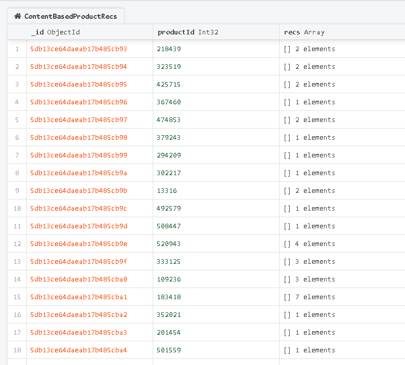

## 基于物品的协同过滤 

基于物品的协同过滤（Item-CF），只需收集用户的常规行为数据（比如点击、收藏、购买）就可以得到商品间的相似度，在实际项目中应用很广。

如果两个商品有同样的受众（感兴趣的人群），那么它们就是有内在相关性的。所以可以利用已有的行为数据，分析商品受众的相似程度，进而得出商品间的相似度。我们把这种方法定义为物品的【同现相似度】，公式如下：

​         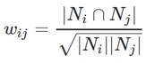  

其中，Ni 是购买商品 i （或对商品 i 评分）的用户列表，Nj 是购买商品 j 的用户列表

### 实现过程

1. 加载 Rating 数据

2. 统计每个商品的评分个数，按照 productId 来做 groupBy 得到 productRatingCountDF

   1. ```java
      得到的数据是：
      | productId | count |
      | 12345689  |  10   |
      ```

3. 然后接着将 productRatingCountDF 加入到 Rating 中

   1. ```scala
      /*
            在原有的评分表上 rating 添加 count
            join 结果：
            +---------+------+-----+-----+
            |productId|userId|score|count|
            +---------+------+-----+-----+
            |505556   |13784 |3.0  |172  |
                       ......
      */
      val ratingWithCountDF = ratingDF.join(productRatingCountDF, "productId")
      ```

4. 将评分按照用户 id 两两配对，统计两个商品被同一个用户评分过的次数。也就是计算公式里面分子处的交集

   1. ```scala
      val joinedDF = ratingWithCountDF.join(ratingWithCountDF, "userId")
            .toDF("userId", "product1", "score1", "count1", "product2", "score2", "count2")
            .select("userId", "product1", "count1", "product2", "count2")
      ```

5. 将 joinedDF 注册成一张表，统计对两个商品同时评分的人数

   1. ```scala
      val cooccurrenceDF = spark.sql(
            """
              |select product1
              |, product2
              |, count(userId) as cocount
              |, first(count1) as count1
              |, first(count2) as count2
              |from joined
              |group by product1, product2
            """.stripMargin
          ).cache()
      ```

6. 提取需要的数据，包装成( productId1, (productId2, score) )

   1. ```scala
      val simDF = cooccurrenceDF.map {
            row =>
              val coocSim = cooccurrenceSim(row.getAs[Long]("cocount")
                , row.getAs[Long]("count1")
                , row.getAs[Long]("count2"))
              (row.getInt(0), (row.getInt(1), coocSim))
          }
            .rdd
            .groupByKey()
            .map {
              case (productId, recs) =>
                ProductRecs(productId, recs.toList
                  .filter(x => x._1 != productId) // 在 recs 中过滤掉与 productId 相同的商品，不同自己推荐自己
                  .sortWith(_._2 > _._2) // 按照分数降序排序
                  .take(MAX_RECOMMENDATION)
                  .map(x => Recommendation(x._1, x._2)) // 组装成被推荐列表的格式 (productId, score)
                ) // 最后封装成存入 MongoDB 的格式 (productId, 多个(productId, score))
            }
            .toDF()
      ```

7. 写入最终结果到 MongoDB

最终统计结果：

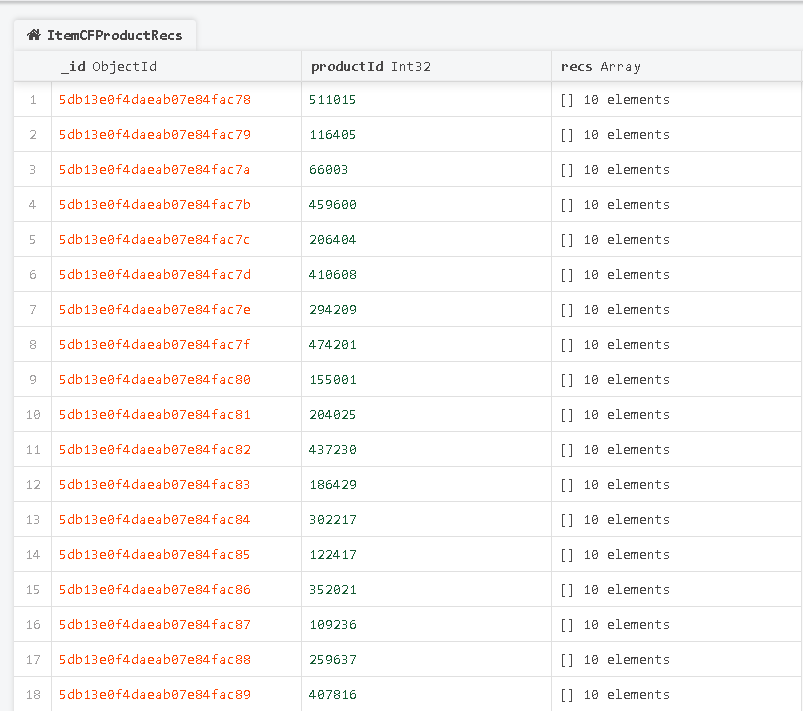

